<p align="center">
<h1 align="center">  AI-Paper-Collector</h1>
</p>
<p align="center">
  	<a href="https://img.shields.io/badge/version-v0.1.0-blue">
      
    </a>
  <a >
       
  	</a>
  <a >
       
  	</a>
   	<a href="https://github.com/MLNLP-World/AI-Paper-collector/stargazers">
       
  	</a>
  	<a href="https://github.com/MLNLP-World/AI-Paper-collector/network/members">
       
  	</a>
    <a href="https://github.com/MLNLP-World/AI-Paper-collector/issues">
      
    </a>
    <br />
</p>

## Motivation

Fully-automated scripts for collecting AI-related papers.
Support fuzzy and exact search for paper titles.



## Search Categories
``` 
- [ACL 2019-2021] [EMNLP 2019-2021] [NAACL 2019-2021] [COLING 2020]
- [CVPR 2019-2021] [ECCV 2020] [ICCV2019] [ACMMM 2019-2021]
- [ICLR 2019-2021] [ICML 2019-2021] [AAAI 2019-2021] [IJCAI 2019-2021]
- [SIGIR 2019-2021] [KDD 2019-2021] [CIKM 2019-2021] [WSDM 2019-2022]
- [WWW 2019-2021] [ECIR 2019-2022] [NIPS 2019-2021] [ICASSP 2019-2021]
```
##  Installation
```shell
pip install -r requirements.txt
```

##  Usage(v0.1.0)
We provide two usage modes, the first is interactive and the second is command-line.
The interactive mode is recommended for the first time users.
```shell
python main.py
```
For command-line usage, you can use the following commands:
```shell
# -q, --query: the input query
# -m, --mode: the search mode: fuzzy or exact, default is exact
# -t, --threshold: the threshold for the fuzzy search, default is 50
# -l, --limit: the limit num of the fuzzy search result, default is None
# -c, --conf: the list of the conferences needs to search, default is all
# -o, --output: the output file name, default is None
# -f, --force: force to update the cache file incrementally
python cli_main.py --query QUERY \
    [--mode {fuzzy,exact}] \
    [--threshold THRESHOLD] [--limit LIMIT] [--conf CONF] \
    [--output OUTPUT] [--force]
```
E.g.
```shell
python cli_main.py -q few-shot -m fuzzy -l 10 -t 10 -c AAAI,ACL -o results.txt
```


## Example

Only 3 steps shown as follows.

1. enter the keyword query
2. options (select search mode and conference source interactively)
3. output path (enter save filename)

```
[+] Initializing System...
[+] Loading from cache...
[+] Enter your query: few-shot

[+] Select search mode:
	[1] Exact
	[2] Fuzzy
[+] Enter a number between 1 to 2: 2
[+] Enter threshold between 0 and 100 (default: 50): 
[+] Enter limit >= 0 (default: None): 
[+] Enter the list of confs separated by comma
	E.g. "ACL,CVPR" or "AAAI" or enter nothing for all confs
[+] Enter your list of conferences (default: All Confs): SIGIR,WSDM,CIKM 

[+] Search Results:
[=] Only show Top-5, Please Save results to see all.
[1] [CIKM2021] REFORM: Error-Aware Few-Shot Knowledge Graph Completion.
[2] [CIKM2021] Boosting Few-shot Abstractive Summarization with Auxiliary Tasks.
[3] [CIKM2021] Multi-objective Few-shot Learning for Fair Classification.
[4] [CIKM2020] Graph Few-shot Learning with Attribute Matching.
[5] [CIKM2020] Few-shot Insider Threat Detection.

[+] Enter Save filename: 
[+] Writing results to output/fuzzy_None_SIGIR_WSDM_CIKM_few-shot.txt
[+] Writing results Done!
```

##  How to add new conferences from DBLP

* add new conferences by modifying the `conf/dblp_conf.json` file
```python
[
    # add the name and dblp_url of the new conf
    {
        "name": "WWW2021",
        "url": "https://dblp.org/db/conf/www/www2021.html"
    },
    ... 
]
```
* run the script
```shell
# force to update the cache file incrementally
python cli_main.py --query '' --force
```

## Organizers
<a href="https://github.com/Doragd">   </a> 

## Contributors
Thanks to the contributors:

<a href="https://github.com/Doragd">   </a> 
<a href="https://github.com/yhshu">  </a> 
